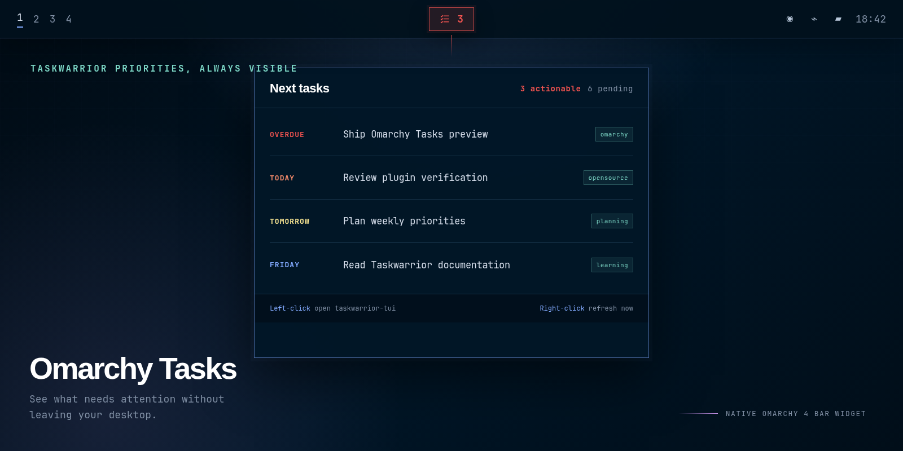

# See Taskwarrior priorities without leaving your desktop

Omarchy Tasks keeps your next Taskwarrior priorities in the Omarchy bar. See due work at a glance, hover for an urgency-ranked list, and open `taskwarrior-tui` with one click.



Your tasks stay in Taskwarrior. The plugin reads them through the `task` command and stores no separate data.

## Quick start

Install Taskwarrior and its terminal UI through Omarchy, then add the plugin:

```bash
omarchy pkg add task taskwarrior-tui
omarchy plugin add https://github.com/janhesters/omarchy-tasks.git --enable
```

Omarchy plugins cannot install system packages. This is why the marketplace marks the plugin as requiring manual setup. If you add the plugin first, left-click its warning icon to open the same Omarchy package command in a terminal.

## What you get

- A red count for overdue tasks and tasks due today.
- A standard count when pending work has no immediate deadline.
- Up to 10 pending tasks in the tooltip, ranked by Taskwarrior urgency.
- One-click access to `taskwarrior-tui`.
- A right-click refresh and an IPC refresh command for scripts.
- A guided install action when Taskwarrior or its TUI is missing.

## Use and configure

- Hover to see pending tasks ranked by urgency.
- Left-click to open `taskwarrior-tui`.
- Right-click to refresh now.

The plugin refreshes every 60 seconds by default. Change the interval or hide the empty-state icon in the Omarchy bar settings.

The widget starts in the center section. Move it with the standard Omarchy bar command:

```bash
omarchy bar move io.github.janhesters.tasks --section center --before omarchy.system-update
```

Scripts can request an immediate refresh after changing a task:

```bash
omarchy-shell io.github.janhesters.tasks refresh
```

## Dependencies and privacy

- `task` provides the Taskwarrior data.
- `taskwarrior-tui` provides the terminal interface opened on left-click.
- `jq` serializes the helper output and ships with Omarchy.

The plugin uses no network access or privileged commands. It reads your local Taskwarrior database and leaves it unchanged.

## Update or remove

```bash
omarchy plugin update io.github.janhesters.tasks
omarchy plugin remove io.github.janhesters.tasks
```

Removing the plugin leaves your Taskwarrior data untouched.

## Omarchy 3 migration

Version 2 replaces the old Waybar module. It no longer edits Waybar CSS, installs a helper in `~/.local/bin`, or adds a Hyprland keybinding. Keep your existing Taskwarrior data and follow the quick-start commands above.

## License

MIT
